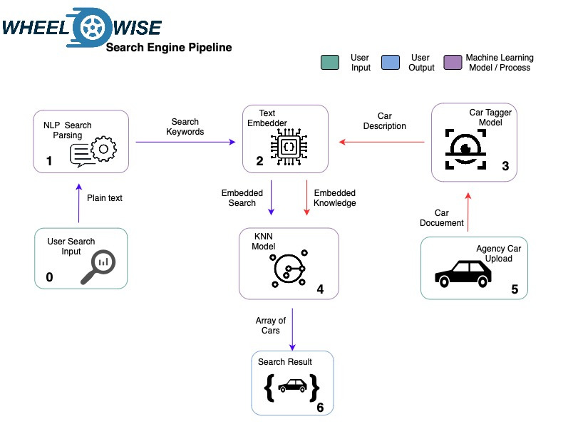

# WW Natural Language Search Engine 😶‍🌫️

This is the search engine implementation for the WheelWise platform, if you want to know a little more about how we came up with it, you can visit the directory called `ProofOfConcept`.

## How it works ?

Basically we propose to represent each car in our database as a vector, to later be able to represent them as a point in space. The user's search can also be represented as a vector of the same dimensions, so we can apply the [KNN](https://en.wikipedia.org/wiki/K-nearest_neighbors_algorithm) algorithm, which will allow us to calculate the "closest" cars to the search vector.

## And the natural language processing?

Technically it is involved in the `vectorization` process we talked about above, converting words to vectors sounds easy, but it's not that easy, besides there are several other processes besides the knn model, like stemming, taking out stopwords etc. We'll talk a little more about our pipline later.

## The Pipeline

The arrows of each color specify a process from an input to an output, except for the flow of the car upload, which does not have an output as it is since it does not have an end beyond which to insert new "knowledge" to the [KNN](https://en.wikipedia.org/wiki/K-nearest_neighbors_algorithm) model.

## The Architecture

We are working on it ...

## License

To determinate.
